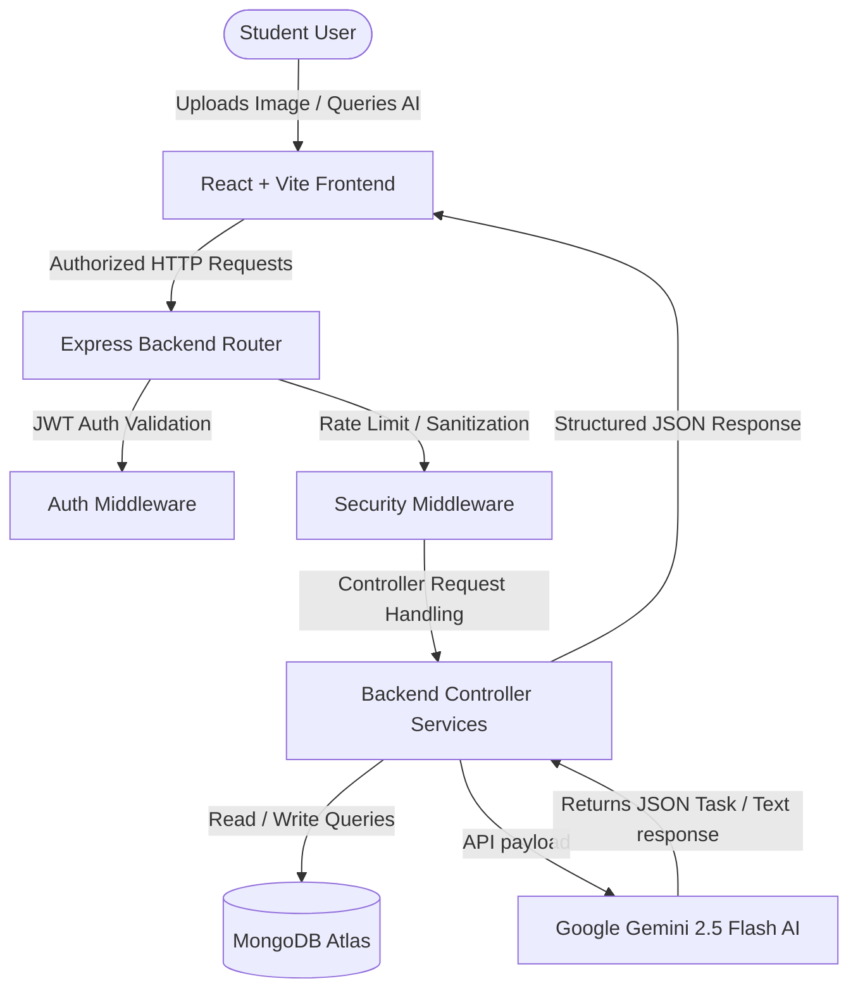

# CampusGenie — Phone-First Student AI Operating System

[](https://nodejs.org)
[](https://react.dev)
[](https://www.mongodb.com/cloud/atlas)
[](https://deepmind.google/technologies/gemini/)
[](LICENSE)

> A modern, mobile-first student productivity platform that transforms screenshots, notice board flyer photos, and study logs into structured tasks and automated AI calendars.

---

## 📖 Project Overview
CampusGenie is designed for the modern mobile workflow of college students. By taking a WhatsApp screenshot of an assignment or snapping a photo of a physical campus notice board, students trigger a multimodal vision analysis through Google's Gemini 2.5 Flash model. CampusGenie instantly parses tasks, structures calendar blocks, generates optimal study paths, and syncs everything with a desktop-compatible Kanban dashboard.

---

## ✨ Features

- **🤖 AI Chat Assistant**: Interactive AI companion using chat context history to assist with study roadmaps, essay outlining, and general academic support.
- **📷 OCR Assignment Scanner**: Parse visual announcements, WhatsApp screenshots, or files using Gemini Vision, automatically populating title, subject, description, priority, and due dates.
- **📋 OCR Notice Scanner**: Extract event names, venues, dates, and registration details from flyer images, automatically drafting editable task calendars.
- **📝 Smart Notes**: Markdown-compatible text notes mapped to courses and subjects with lightning-fast full-text searches.
- **📅 AI Study Planner**: Auto-generate study roadmaps with customized duration, target difficulty, available hours, and automatic streak tracking.
- **📊 Assignment Kanban Board**: Interactive, drag-and-drop board to track todo, in-progress, and completed assignments.
- **🔒 Secure JWT Authentication**: Full JWT-based auth flow with session restoration and auto-logout safeguards.

---

## 🛠️ Tech Stack

### Frontend
- **Framework**: React.js (v18.2) + Vite
- **Styling**: Tailwind CSS + Framer Motion (micro-animations)
- **State & Routing**: React Router DOM (v6) + React Hooks
- **Drag-and-Drop**: `@dnd-kit/core` + `@dnd-kit/sortable`
- **Networking**: Axios (with custom request deduplication and auth interceptors)

### Backend
- **Runtime**: Node.js + Express
- **Database**: MongoDB Atlas via Mongoose ORM
- **AI Core**: Google Gemini SDK (`@google/generative-ai`)
- **Middlewares**: Helmet (security headers), Express Rate Limit (DDoS protection), Express Mongo Sanitize (query injection blocking), Compression (gzip), Morgan (logger).
- **Uploads**: Multer (configured in-memory buffer storage to prevent disk space leaks).

---

## 📐 Architecture Flow



---

## 📸 Screenshots

*Placeholders for user-provided screenshots:*

| **Dashboard View** | **AI Study Planner** |
|:---:|:---:|
| `` | `` |

| **OCR Document Scanner** | **AI Chat Assistant** |
|:---:|:---:|
| `` | `` |

---

## ⚙️ Environment Setup

### Backend Environment Configuration (`backend/.env`)
Create a `.env` file in the `backend/` directory:
```env
PORT=8000
NODE_ENV=development
MONGO_URI=mongodb+srv://<username>:<password>@cluster.mongodb.net/campusgenie
JWT_SECRET=your_strong_jwt_secret_token
JWT_EXPIRES_IN=7d
CORS_ORIGIN=http://localhost:5173
GEMINI_API_KEY=your_google_gemini_api_key
GEMINI_MODEL=gemini-2.5-flash
UPLOAD_SIZE_LIMIT=5242880
TZ=UTC
```

### Frontend Environment Configuration (`frontend/.env`)
Create a `.env` file in the `frontend/` directory:
```env
VITE_API_URL=http://localhost:8000/api
VITE_APP_NAME=CampusGenie
```

---

## 🚀 Installation & Local Running

1. **Clone the repository**:
   ```bash
   git clone https://github.com/your-username/campusgenie.git
   cd campusgenie
   ```

2. **Install all dependencies** (Runs root, frontend, and backend installations concurrently):
   ```bash
   npm run install-all
   ```

3. **Start Development Servers**:
   ```bash
   npm run dev
   ```
   - Frontend is hosted on: `http://localhost:5173`
   - Backend is hosted on: `http://localhost:8000`

---

## 🛡️ Security Implementations
- **Helmet**: Hardens HTTP response headers against clickjacking, script injection, and sniffing.
- **Express Rate Limit**: Imposed rate limiting constraints specifically on critical routes:
  - `/api/auth`: Max 30 attempts per 15 minutes.
  - `/api/ocr`: Max 15 image scans per 10 minutes.
  - `/api/chat`: Max 50 messages per 5 minutes.
- **Mongo Sanitize**: Sanitizes input parameters to block query injections.
- **Memory Buffer Uploads**: Files uploaded to Multer are processed completely in RAM buffers, avoiding temporary disk writes.

---

## 📡 API Reference

### Authentication
- `POST /api/auth/signup` - Register a new account.
- `POST /api/auth/login` - Authenticate credentials and receive a JWT.
- `GET /api/auth/me` - Get current user profile (JWT protected).

### Assignments
- `GET /api/assignments` - Fetch user's assignments.
- `POST /api/assignments` - Create a manual assignment.
- `GET /api/assignments/stats` - Fetch assignment counts for the Kanban board.
- `PATCH /api/assignments/:id` - Edit status or details.
- `DELETE /api/assignments/:id` - Remove assignment.

### Study Planner
- `GET /api/planner/sessions` - Fetch study sessions.
- `POST /api/planner/sessions` - Save manual or AI planner sessions.
- `GET /api/planner/streak` - Fetch learning streak statistics.
- `POST /api/planner/generate` - Trigger Gemini AI study roadmap recommendations.

### AI Chatbot
- `GET /api/chat/sessions` - Fetch user's conversation threads.
- `POST /api/chat/sessions` - Create a new chat session.
- `POST /api/chat/sessions/:id/messages` - Submit message to thread and receive Gemini response.

### OCR (Multimodal Image Scanner)
- `POST /api/ocr/assignment` - Parse assignment parameters from flyer upload.
- `POST /api/ocr/notice` - Parse event parameters from flyer upload.
- `POST /api/ocr/text` - Perform plain text transcription OCR.

---

## 📜 License
This project is licensed under the MIT License - see the [LICENSE](LICENSE) file for details.
